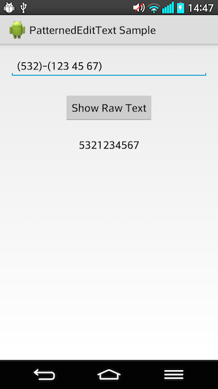

## PatternedEditText [](https://travis-ci.org/faradaj/PatternedEditText.svg)

`PatternedEditText` is an `EditText` that shows its text according to a pattern.

If you want your `EditText` to show its text with slight modifications as the user inputs, you need to implement a `TextWatcher`.

With using default `EditText`s, you need to implement another `TextWatcher`s for a different input type.

`PatternedEditText` provides you a simple way to define a pattern of your need.

For instance,
- "#### #### #### ####" as Credit Card Numbers,
- "(###)-(### ## ##)" as Phone Numbers,
- "##/##/####" as Dates etc.



### Usage

Define your `PatternedEditText` in your layout.

```xml
<com.faradaj.patternededittext.PatternedEditText
            xmlns:pet="http://schemas.android.com/apk/res-auto"
            android:id="@+id/edit_text_phone_number"
            pet:pattern="(###)-(### ## ##)"
            pet:specialChar="#"     <!-- optional, '#' by default -->
            pet:showHint="true"     <!-- optional, false by default -->
            android:inputType="number"
            android:digits="0123456789 ()-"
            android:layout_width="match_parent"
            android:layout_height="wrap_content"/>
```

`pet:pattern`:      This is your pattern definition, you need to define one.
`pet:specialChar`:  This is the special character that you use in your pattern to indicate user-input characters.
                    If you don't define one '#' character is used.
`pet:showHint`:     If you set this `true`, your pattern is used as hint, overriding `EditText`s `android:hint`.

#### Important Points

- You need to use `getRawText()` method when you need your `PatternedEditText`s raw text.

- You need to add necessary digits to `android:digits` of `PatternedEditText`.
    For instance, phone number may only need numbers so you had defined `android:inputType="number"` previously.
    And if your pattern `pet:pattern="(###)-(### ## ##)"` includes custom characters, now you need to define `android:digits="0123456789 ()-"` too.

### Dependency

- Run `gradle install` on `patterned-edit-text` library project.

- In your `build.gradle`:
```groovy
repositories {
    mavenLocal()
}
dependencies {
    compile 'com.faradaj:patterned-edit-text:[LATEST_RELEASE_VERSION]'
}
```

or

- In your `pom.xml`:
```xml
<dependency>
  <groupId>com.faradaj</groupId>
  <artifactId>patterned-edit-text</artifactId>
  <version>[LATEST_RELEASE_VERSION]</version>
</dependency>
```

or you can clone and add `patterned-edit-text` as a library project to yours.

### License

    The MIT License (MIT)
    
    Copyright (c) 2014 Gokberk Ergun
    
    Permission is hereby granted, free of charge, to any person obtaining a copy
    of this software and associated documentation files (the "Software"), to deal
    in the Software without restriction, including without limitation the rights
    to use, copy, modify, merge, publish, distribute, sublicense, and/or sell
    copies of the Software, and to permit persons to whom the Software is
    furnished to do so, subject to the following conditions:
    
    The above copyright notice and this permission notice shall be included in all
    copies or substantial portions of the Software.
    
    THE SOFTWARE IS PROVIDED "AS IS", WITHOUT WARRANTY OF ANY KIND, EXPRESS OR
    IMPLIED, INCLUDING BUT NOT LIMITED TO THE WARRANTIES OF MERCHANTABILITY,
    FITNESS FOR A PARTICULAR PURPOSE AND NONINFRINGEMENT. IN NO EVENT SHALL THE
    AUTHORS OR COPYRIGHT HOLDERS BE LIABLE FOR ANY CLAIM, DAMAGES OR OTHER
    LIABILITY, WHETHER IN AN ACTION OF CONTRACT, TORT OR OTHERWISE, ARISING FROM,
    OUT OF OR IN CONNECTION WITH THE SOFTWARE OR THE USE OR OTHER DEALINGS IN THE
    SOFTWARE.
